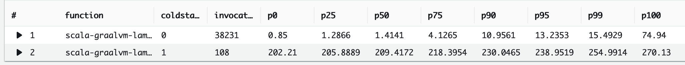

my attempt at setting up a lambda that is written in scala but uses graalvm to create a single, static binary + a custom
aws runtime (see [`Bootstrap.scala`](./src/main/scala/example/Bootstrap.scala))

1. create a bucket to store the lambda code
2. run `./deployment/deploy.sh <the-bucket-name-from-step-1>`
3. wait
4. go into the aws console and invoke the function via the `Test` tab

### Results

(not scientific at all, first row is non-coldstarts, second row are the coldstarts, in milliseconds):



Loadtest:

```sh
npx artillery quick --count 20 --num 1000 <function url>
```

Query:

```
filter @type = "REPORT"
    | parse @log /\d+:\/aws\/lambda\/(?<function>.*)/
    | stats
    count(*) as invocations,
    pct(@duration+coalesce(@initDuration,0), 0) as p0,
    pct(@duration+coalesce(@initDuration,0), 25) as p25,
    pct(@duration+coalesce(@initDuration,0), 50) as p50,
    pct(@duration+coalesce(@initDuration,0), 75) as p75,
    pct(@duration+coalesce(@initDuration,0), 90) as p90,
    pct(@duration+coalesce(@initDuration,0), 95) as p95,
    pct(@duration+coalesce(@initDuration,0), 99) as p99,
    pct(@duration+coalesce(@initDuration,0), 100) as p100
    group by function, ispresent(@initDuration) as coldstart
    | sort by coldstart, function
```

### for local testing

1. `./deployment/build.sh`
2. `docker build -t docker-lambda .`
3. `docker run -p 9000:8080 docker-lambda:latest`
4. Send a test event: `curl "http://localhost:9000/2015-03-31/functions/function/invocations" -d 'Hello world!'`

### Resources

- https://github.com/andthearchitect/aws-lambda-java-runtime
- https://docs.aws.amazon.com/lambda/latest/dg/images-test.html
- https://github.com/aws/aws-lambda-runtime-interface-emulator/
- https://towardsdatascience.com/aws-lambda-with-custom-docker-images-as-runtime-9645b7baeb6f
- https://aripalo.com/blog/2020/aws-lambda-container-image-support/
- https://docs.aws.amazon.com/lambda/latest/dg/runtimes-api.html
- https://aws.amazon.com/blogs/compute/build-a-custom-java-runtime-for-aws-lambda/
- https://www.formkiq.com/blog/tutorials/aws-lambda-graalvm/
- https://docs.aws.amazon.com/lambda/latest/dg/configuration-envvars.html#configuration-envvars-runtime
